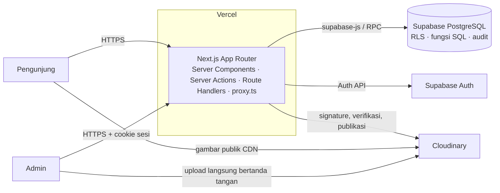
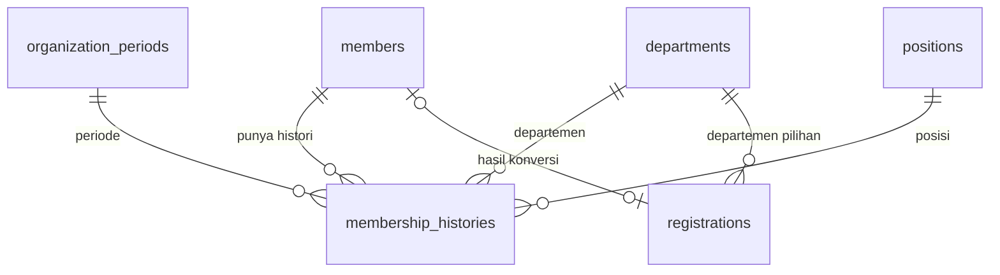

# Arsitektur Sistem UVICS

**Diperbarui:** 10 Oktober 2026 (kondisi branch `development`)
**Rujukan:** [Tech stack](TECH_STACK.md) untuk pilihan teknologi · [Kontrak backend](BACKEND_CONVENTIONS.md) untuk aturan detail · [Runbook operator](BACKEND_OPERATIONS.md) untuk setup dan migration

Dokumen ini adalah peta: komponen apa saja yang ada, di mana kodenya, dan bagaimana data mengalir. Aturan rinci tidak diulang di sini; ikuti tautan ke dokumen sumbernya.

## 1. Gambaran sistem

Satu aplikasi Next.js melayani website publik, dashboard admin, dan backend. Data dan autentikasi ada di Supabase; media di Cloudinary.



| Komponen | Peran | Catatan |
| --- | --- | --- |
| Next.js (Vercel) | Render halaman, otorisasi admin, validasi Zod, memanggil database | Semua logika domain di server; browser tidak memegang kredensial berprivilege |
| Supabase PostgreSQL | Sumber data utama | RLS fail-closed; mutasi penting lewat fungsi SQL yang menulis audit |
| Supabase Auth | Login admin (email/password) | Signup publik nonaktif; applicant bukan user Auth |
| Cloudinary | Penyimpanan dan delivery media | Upload pending privat; publikasi lewat salinan baru setelah izin domain |
| GitHub Actions | CI (`verify`) | Lint, typecheck, unit test, DB test, build, e2e subset |

## 2. Struktur kode

| Lokasi | Isi |
| --- | --- |
| `app/(public)/` | Website publik dan layout navigasi publik. `(marketing)/` berisi halaman informasi (about, contact, …). |
| `app/admin/login/`, `app/admin/(protected)/` | Login admin dan seluruh halaman dashboard yang dilindungi |
| `app/(auth)/login`, `app/(dashboard)/` | Alias lama yang redirect ke `/admin/login` dan `/admin/dashboard` |
| `app/api/admin/media/*` | Route Handler upload media: `signature`, `complete`, `[id]` |
| `app/api/contact` | Stub; belum menyimpan atau mengirim pesan (lihat [U13](DECISIONS.md#u13--form-kontak)) |
| `proxy.ts` | Menolak mutasi lintas origin dan menyegarkan cookie sesi Supabase setiap request |
| `components/` | `layout/` (header, footer), `sections/` (blok halaman), `ui/` (primitif), `forms/`, `admin/`, `competitions/` |
| `config/` | Navigasi publik dan admin |
| `lib/auth/` | `requireAdmin` (action/handler), `requirePageAdmin` (halaman), alur login |
| `lib/backend/` | Error dan kode HTTP, validasi Zod bersama, rate limit, pemeriksaan request, schema domain (`organization.ts`, `membership.ts`) |
| `lib/supabase/` | Client `browser`, `server` (sesi pengguna), dan `service` (khusus operasi server tertentu) |
| `lib/media/` | Kebijakan kategori, intent upload, integrasi Cloudinary, publikasi |
| `lib/env/` | Pembacaan environment publik dan server |
| `data/`, `lib/mock-data/` | Data mock sementara; diganti data Supabase selama Sprint 2 |
| `supabase/migrations/` | Seluruh schema, RLS, dan fungsi SQL |
| `scripts/` | Tooling operator: migrate, provisioning admin, generate types, seed, test DB |
| `tests/unit/`, `tests/db/`, `tests/e2e/` | Vitest, tes SQL di PostgreSQL disposable, Playwright |
| `types/database.ts` | Tipe TypeScript dari schema database |

## 3. Domain data

| Domain | Tabel | Migration | Issue | Status |
| --- | --- | --- | --- | --- |
| Fondasi | `admins`, `audit_logs`, `private.rate_limit_counters`, `private.upload_intents` | `20260922090000`–`20260922104500` | #7 | Di `development` |
| Organisasi | `departments`, `positions`, `organization_periods`, `membership_histories` | `20260922110000` | #9 | Di `development` |
| Membership | `members`, `registrations` | `20260922120000` | #8 | Di `development` |
| CMS | `pages`, `programs`, `website_settings` | `20261003192000` | #10 | Di `development` |
| Konten | `competitions`, `achievements`, `projects`, `achievement_members`, `project_members` | — | #11 | PR #20 belum di-merge |
| Belum dibuat | news/posts, events, gallery, partners, periode pendaftaran | — | — | Sprint berikutnya |

Relasi inti organisasi dan membership:



Aturan data yang berlaku: UUID sebagai primary key, `timestamptz` untuk kejadian, `date` untuk tanggal kalender, status huruf besar dengan check constraint, soft delete per entitas. Detail di [kontrak backend](BACKEND_CONVENTIONS.md#kontrak-data) dan keputusan [D12–D14](DECISIONS.md#b-keputusan-produk-dan-data-yang-diterima).

## 4. Alur utama

### 4.1 Pengunjung membaca halaman publik

```text
Server Component → lib/supabase/server (tanpa sesi) → view/RPC/tabel yang diizinkan RLS
                 → DTO berisi field publik saja → render
```

- Hanya data berstatus publikasi valid yang dikirim. Draft, NIM, kontak pribadi, jawaban registrasi, dan catatan admin tidak pernah keluar ([D02](DECISIONS.md#a-keputusan-teknis-d01d05-kontrak-3133)).
- **Kondisi saat ini:** halaman publik masih memakai data mock, dan role `anon` belum punya akses ke tabel organisasi. Jalur baca publik diputuskan di [U02](DECISIONS.md#u02--akses-publik-data-organisasi).

### 4.2 Admin login

```text
/admin/login → Server Action → rate limit (RPC) → Supabase Auth → record_admin_login (audit)
             → cookie sesi SSR (@supabase/ssr) → /admin/dashboard
```

- Sesi admin maksimal satu jam absolut sejak login; refresh tidak memperpanjangnya.
- `proxy.ts` menyegarkan cookie, tetapi setiap action, handler, dan query privat tetap memeriksa admin sendiri (`requireAdmin` / `requirePageAdmin` dan predicate `private.has_active_admin_session()` di database).

### 4.3 Admin mengubah data

```text
Server Action → requireAdmin → validasi Zod → RPC SQL
   └─ di dalam satu transaksi: cek sesi admin → validasi state → INSERT/UPDATE → private.write_audit
```

- Tidak ada UPDATE langsung dari client ke tabel domain; grant tulis untuk `authenticated` tidak diberikan ([D13](DECISIONS.md#b-keputusan-produk-dan-data-yang-diterima)).
- Contoh yang sudah ada: `publish_page`, `publish_program`, `record_admin_login`.

### 4.4 Upload media

```text
1. POST /api/admin/media/signature → cek admin + rate limit → create_upload_intent → signature
2. Browser upload langsung ke Cloudinary (privat/pending)
3. POST /api/admin/media/complete → verifikasi metadata Cloudinary → complete_upload_intent
4. Publikasi (bila konten domain mengizinkan) → begin/finish_media_publication → salinan publik baru
```

Kategori, batas ukuran, dan format: lihat [kontrak backend — Media](BACKEND_CONVENTIONS.md#media).

## 5. Keamanan

| Lapisan | Mekanisme |
| --- | --- |
| Request | `proxy.ts` menolak mutasi dengan Origin yang tidak sama persis dengan `APP_ORIGIN`; cookie `Secure`, `SameSite=Lax`, host-only |
| Aplikasi | Pemeriksaan admin di setiap action/handler; validasi Zod di server; error tidak membocorkan detail provider |
| Database | RLS fail-closed di semua tabel publik; grants minimum; fungsi berprivilege dengan `search_path` aman dan EXECUTE PUBLIC dicabut |
| Rate limit | Counter PostgreSQL atomik untuk login, signature, dan complete upload; gagal limiter → 503 |
| Kredensial | Secret key Supabase dan Cloudinary hanya di server; tidak pernah dikirim ke browser |
| Audit | Mutasi penting dan login dicatat di `audit_logs` dalam transaksi yang sama |

## 6. Lingkungan dan rilis

- **Satu project Supabase dan satu environment Cloudinary** dipakai dari pengembangan sampai production. Tidak ada staging terpisah dan database bersama tidak pernah di-reset.
- **CI** menjalankan tes database di PostgreSQL disposable tanpa credential hosted.
- **Migration hosted** dijalankan operator lewat `npm run db:migrate -- <project-ref>`, terpisah dari build dan deploy.
- **Deploy** aplikasi ke Vercel. Region, domain, dan kebijakan backup belum ditetapkan ([TECH_STACK](TECH_STACK.md#status-dan-hal-yang-belum-ditetapkan)).
- Alur branch dan rilis: [workflow pengembangan](DEVELOPMENT_WORKFLOW.md).
